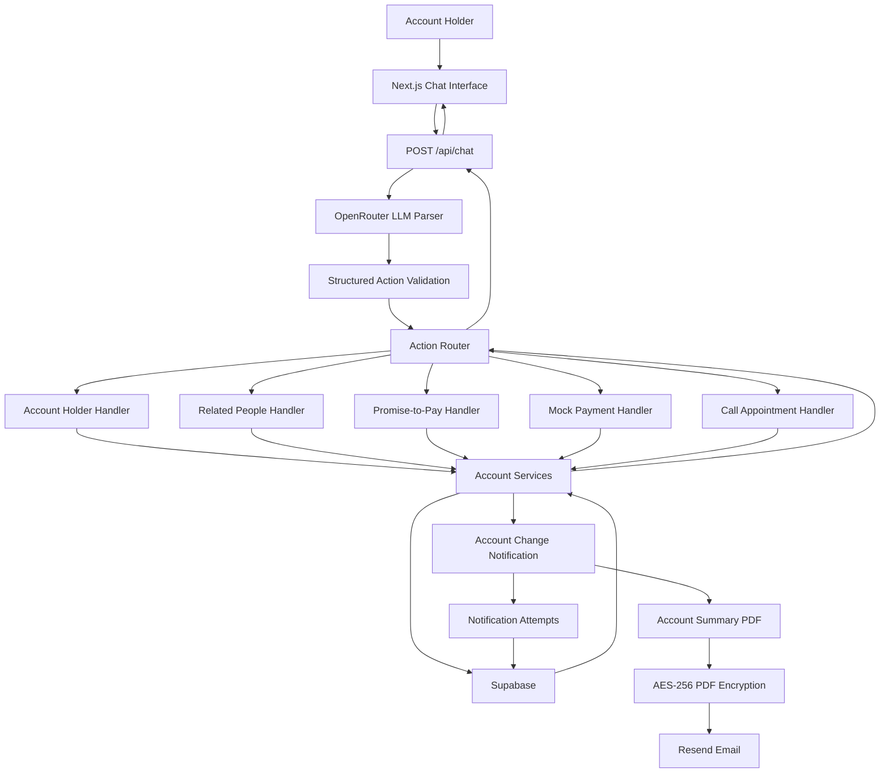

# Architecture Diagram

The application separates natural-language interpretation from deterministic business logic and side effects. The LLM produces structured actions only and never writes directly to the database.

## Key Boundaries

- **LLM parser:** converts free-text messages into structured actions and fields.
- **Validation and routing:** validates LLM output before any business operation is executed.
- **Business services:** enforce deterministic validation and persistence rules.
- **Supabase:** stores account data, related people, promises, transactions, appointments, balances, and notification attempts.
- **Mock payments:** update the transaction history and account balance atomically and use request IDs to protect against duplicate processing.
- **Notification service:** runs after successful persisted changes and records delivery attempts.
- **PDF generation:** creates the current account summary and encrypts it using the last four digits of the current account phone number.
- **Resend:** sends a generic email containing no sensitive account details, with the encrypted PDF attached.
